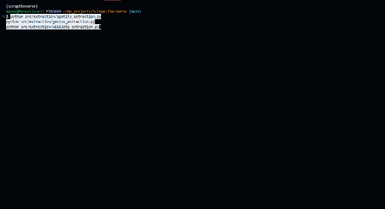
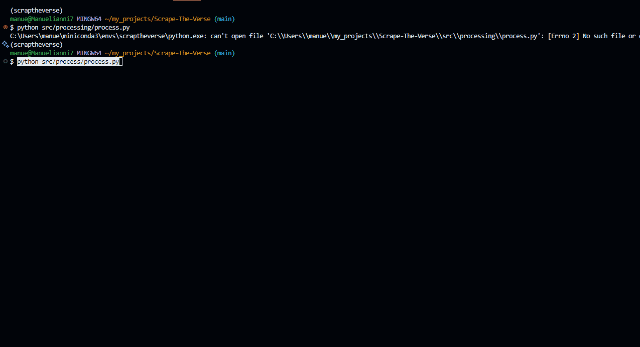
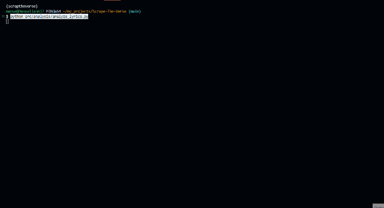
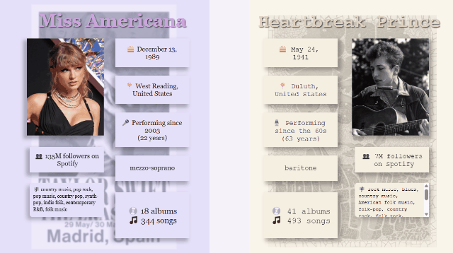
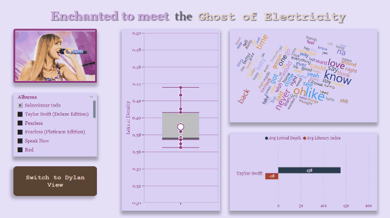
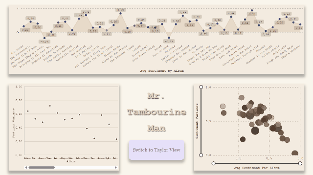

# 🎶 Scrape The Verse


*He wrote “Tangled Up in Blue,” she wrote “The Story of Us”—we wrote the code to ask if Swift could follow Dylan to Stockholm.*

> 📚 This project is a full-blown, ETL-powered attempt to answer one brilliant, nerdy, and slightly unhinged question:  
> **Can Taylor Swift win the Nobel Prize in Literature?**  
> (Spoiler: if Bob Dylan did, why not her?)

> *“There’s no success like failure, and failure’s no success at all.”* — Bob Dylan  
> *“I want to be defined by the things that I love.”* — Taylor Swift

---

## 🚀 What is this?
**“It’s me, hi — I’m the pipeline, it’s me.”**

**Scrape The Verse** is a modular ETL + NLP pipeline built in Python to scrape and analyze:

- 🎧 Spotify metadata (artists, albums, songs)
- 📝 Genius lyrics (by album)
- 🧠 Wikidata metadata (biographical and artistic traits)

With one literary mission:  
**Build a clean, analyzable dataset to explore songwriting quality through the lens of literary merit.**

---

## 🧠 Project Status
**“The times they are a-changin’ — but this repo’s ready.”**

**Stable and modular** — the project is fully functional and structured as a clear ETL pipeline with reusable components and database integration.

### ✅ Core Features

- Modular scrapers for Spotify, Genius, and Wikidata
- Lyrics + metadata transformation and merging
- Track-level NLP analysis:
  - Flesch readability
  - Sentiment (VADER)
  - Lexical density
  - Word/line/character counts
- Word frequency tables for tracks and albums
- PostgreSQL loader with relational schema + data integrity
- Robust dependency validation (`nltk`, `spaCy`, etc.)
- Batch logging of missing or matched lyrics
- Fully interactive CLI for all pipeline stages
- Clean, testable, documented and type-annotated Python code (SOLID-ready)

---

## 📁 Project Structure  
**“Organized like a vault track. Documented like ‘Desolation Row.’”**

```text
src/
├── analysis/
│   ├── __init__.py
│   └── analyze_lyrics.py
├── extraction/
│   ├── __init__.py
│   ├── genius_extraction.py
│   ├── spotify_extraction.py
│   └── wikidata_extraction.py
├── transformation/
│   ├── __init__.py
│   ├── genius_transformation.py
│   ├── spotify_transformation.py
│   └── wikidata_transformation.py
├── process/
│   ├── __init__.py
│   └── process.py
├── load/
│   ├── __init__.py
│   └── load.py

raw/
├── GENIUS/
├── SPOTIFY/
└── WIKIDATA/

transformations/
├── GENIUS/
└── SPOTIFY/

processed/
└── <artist>/
    └── <album>_final.csv

docs/
├── gifs/
├── index.md
├── installation.md
├── overview.md
└── usage.md

db/
└── create_schema.sql

logs/
```

---

## ⚙️ Setup
**“First you get the access token, then you get the data, then you change the world.”**

From cloning to conda to credentials, it’s all here — just like a deluxe edition rollout.

### 1. Clone the repo

```bash
git clone https://github.com/<your-username>/Scrape-The-Verse.git
cd Scrape-The-Verse
```

### 2. Create your `.env` file

```dotenv
SPOTIPY_CLIENT_ID=your_spotify_id
SPOTIPY_CLIENT_SECRET=your_spotify_secret
SPOTIPY_REDIRECT_URI=http://localhost:8080
GENIUS_CLIENT_ACCESS_TOKEN=your_genius_token
POSTGRES_DB=your_database
POSTGRES_USER=your_user
POSTGRES_PASSWORD=your_password
POSTGRES_HOST=localhost
POSTGRES_PORT=5432
```

### 3. Create and activate the Conda environment

```bash
conda create -n scraptheverse python=3.10
conda activate scraptheverse
pip install -r requirements.txt
python -m spacy download en_core_web_sm
```

---

## 🧪 Initialize the Database
**“Some PostgreSQL tables, just to keep you company.”**  
(*Probably* what Taylor says to her ERD diagrams.)

Before loading data, create the PostgreSQL schema:

```bash
psql -U <your_user> -d <your_database> -f db/create_schema.sql
```

Or run it directly in DBeaver.

---

## ▶️ Run the Pipeline
**“From Red to Reputation, one script at a time.”**

Whether you're running it track by track or all at once, this pipeline flows smoother than *Blonde on Blonde*.

```bash
# Step 1: Scrape data
python src/extraction/spotify_extraction.py
python src/extraction/genius_extraction.py
python src/extraction/wikidata_extraction.py

# Step 2: Clean & transform
python src/transformation/spotify_transformation.py
python src/transformation/genius_transformation.py
python src/transformation/wikidata_transformation.py

# Step 3: Merge lyrics with tracks
python src/process/process.py

# Step 4: Load to PostgreSQL
python src/load/load.py

# Step 5: Analyze lyrics
python src/analysis/analyze_lyrics.py
```

You can run every step at once, too.

```bash
python main.py
```

---

---

## 🎥 Pipeline Demo
**“We bring receipts — and by that, we mean animated .gifs.”**

A visual tour from scraping to NLP, because if it’s not in a GIF, did it even happen?

### 🔍 Extraction


### 🧼 Transformation


### 🧩 Merging Lyrics with Metadata


### 💾 Loading to PostgreSQL


### 📈 NLP Analysis



---

## 📊 Database Schema Overview
**“Structured like a bridge. Normalized like a Dylan verse.”**

Includes everything from `lyrics` to `word_frequencies_album`. No easter eggs, just solid SQL.

- `artists`: identity & biography  
- `albums`: linked to artist  
- `tracks`: song-level data  
- `lyrics`: raw text + readability, sentiment, lexical stats  
- `word_frequencies_track`: for song-level word clouds  
- `word_frequencies_album`: for album-level word clouds

Defined in [`db/create_schema.sql`](db/create_schema.sql)

---

## 💡 Example Use Cases
**“Use cases that go deeper than Track 5.”**

- Compare **lexical density** of Bob Dylan vs Taylor Swift  
- Visualize **frequent motifs** (love, time, silence...) by album  
- Track evolution of **sentiment** or **explicitness** across eras  
- Build dashboards to answer: *"Is this Nobel-worthy poetry?"*

---

## 📊 Power BI Dashboard Demos
**“If a chart falls in the forest, but it’s not in Power BI, did it really insight?”**

A first look at the visual storytelling behind the metrics. Think *Miss Americana* meets *Don’t Look Back*.

### 🧾 Summary Cards View


### ✍️ Literary Quality Breakdown


### ❤️ Emotional Depth & Sentiment


---

## 🤝 Contributing  
**“Bring your pull requests — and your cardigan.”**

Pull requests are always welcome — especially if you can write a left join with the same finesse as a bridge in *All Too Well (10 Minute Version)*.  
Just one rule: no *Folklore* vs *1989* wars in the issues. We honor the whole catalog here.

---

## ✨ Credits
**“Built by a Swiftie. Haunted by a Dylan lyric.”**

Created by Manuel Cruz Rodríguez — a language lover with too many browser tabs and a playlist that won’t quit.  
Born from books, lyrics… and one Nobel Prize nobody saw coming.

> “You’re on your own, kid — but this script doesn’t need backup.”  
> — T. Swift, if she used Git.

