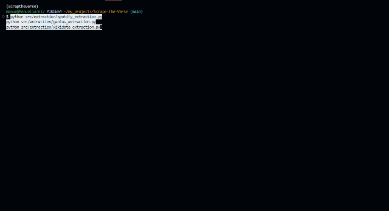
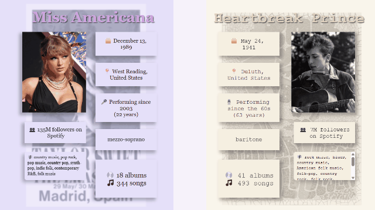
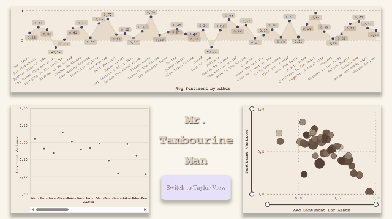

# 🎶 Scrape The Verse


*He wrote “Tangled Up in Blue,” she wrote “The Story of Us”—we wrote the code to ask if Swift could follow Dylan to Stockholm.*

> 📚 Este proyecto es un experimento ETL completo, ambicioso y un poco obsesivo para responder una pregunta algo desquiciada:  
> **¿Puede Taylor Swift ganar el Premio Nobel de Literatura?**  
> (Spoiler: si Bob Dylan lo logró…)

> *“There’s no success like failure, and failure’s no success at all.”* — Bob Dylan  
> *“I want to be defined by the things that I love.”* — Taylor Swift

---

## 🚀 ¿Qué es?
**“It’s me, hi — I’m the pipeline, it’s me.”**

**Scrape The Verse** es un pipeline modular ETL + PLN construido en Python para extraer y analizar:

- 🎧 Metadatos de Spotify (artistas, álbumes, canciones)  
- 📝 Letras desde Genius (por álbum)  
- 🧠 Datos biográficos y artísticos desde Wikidata

Con un objetivo literario:  
**Construir un dataset limpio y analizable para explorar la calidad lírica desde una perspectiva literaria.**

---

## 🧠 Estado del proyecto
**“The times they are a-changin’ — but this repo’s ready.”**

El proyecto está **estable y modular** — completamente funcional, estructurado como un pipeline ETL claro, con componentes reutilizables e integración con base de datos.

### ✅ Características principales

- Scrapers modulares para Spotify, Genius y Wikidata  
- Transformación y fusión de letras y metadatos  
- Análisis PLN a nivel de pista:
  - Legibilidad de Flesch
  - Sentimiento (VADER)
  - Densidad léxica
  - Recuento de palabras, líneas y caracteres  
- Tablas de frecuencia de palabras por pista y por álbum  
- Carga en PostgreSQL con esquema relacional e integridad de datos  
- Validación robusta de dependencias (`nltk`, `spaCy`, etc.)  
- Registro por lotes de letras faltantes o coincidentes  
- CLI interactiva para todas las etapas del pipeline  
- Código Python limpio, testeable, documentado y tipado (listo para SOLID)

---

## 📁 Estructura del proyecto  
**“Organizado como un *bonus track*. Documentado como ‘Desolation Row’.”**

```text
src/
├── analysis/
│   ├── __init__.py
│   └── analyze_lyrics.py
├── extraction/
│   ├── __init__.py
│   └── genius_extraction.py
│   └── spotify_extraction.py
│   └── wikidata_extraction.py
├── transformation/
│   ├── __init__.py
│   └── genius_transformation.py
│   └── spotify_transformation.py
│   └── wikidata_transformation.py
├── process/
│   ├── __init__.py
│   └── process.py
├── load/
│   ├── __init__.py
│   └── load.py

raw/
├── GENIUS/
├── SPOTIFY/
└── WIKIDATA/

transformations/
├── GENIUS/
└── SPOTIFY/

processed/
└── <artist>/
    └── <album>_final.csv

docs/
├── gifs/
├── index.md
├── installation.md
├── overview.md
└── usage.md

db/
└── create_schema.sql

logs/
```

---

## ⚙️ Instalación
**“Primero obtienes el token; luego, los datos; luego, cambias el mundo.”**

Desde la clonación hasta las credenciales, como si fuera el lanzamiento de una edición *deluxe*.

### 1. Clona el repositorio

```bash
git clone https://github.com/<tu-usuario>/Scrape-The-Verse.git
cd Scrape-The-Verse
```

### 2. Crea tu archivo `.env`

```dotenv
SPOTIPY_CLIENT_ID=your_spotify_id
SPOTIPY_CLIENT_SECRET=your_spotify_secret
SPOTIPY_REDIRECT_URI=http://localhost:8080
GENIUS_CLIENT_ACCESS_TOKEN=your_genius_token
POSTGRES_DB=your_database
POSTGRES_USER=your_user
POSTGRES_PASSWORD=your_password
POSTGRES_HOST=localhost
POSTGRES_PORT=5432
```

### 3. Crea y activa el entorno Conda

```bash
conda create -n scraptheverse python=3.10
conda activate scraptheverse
pip install -r requirements.txt
python -m spacy download en_core_web_sm
```

---

## 🧪 Crea la base de datos
**“Algunas tablas en PostgreSQL, solo para hacerte compañía.”**  
(*Probablemente* lo que Taylor le diría a sus diagramas ERD).

Antes de cargar datos, crea el esquema en PostgreSQL:

```bash
psql -U <tu_usuario> -d <tu_base_de_datos> -f db/create_schema.sql
```

O ejecútalo directamente desde DBeaver.

---

## ▶️ Ejecutar el *pipeline*
**“De Red a Reputation, un script a la vez.”**

Puedes ejecutar el pipeline paso a paso o todo de una sola vez.

```bash
# Paso 1: Extraer datos
python src/extraction/spotify_extraction.py
python src/extraction/genius_extraction.py
python src/extraction/wikidata_extraction.py

# Paso 2: Limpiar y transformar
python src/transformation/spotify_transformation.py
python src/transformation/genius_transformation.py
python src/transformation/wikidata_transformation.py

# Paso 3: Unir letras con metadatos
python src/process/process.py

# Paso 4: Cargar en PostgreSQL
python src/load/load.py

# Paso 5: Analizar letras
python src/analysis/analyze_lyrics.py
```

O todo a la vez:

```bash
python main.py
```

---

## 🎥 Demostración del *pipeline*
**“Tenemos pruebas — y sí, son gifs.”**

Una guía visual desde el scraping hasta el análisis, porque si no está en un GIF, ¿realmente pasó?

### 🔍 Extracción


### 🧼 Transformación


### 🧩 Fusión de letras y metadatos


### 💾 Carga en PostgreSQL


### 📈 Análisis PLN


---

## 📊 Esquema de la base de datos
**“Estructurado como un puente. Normalizado como un verso de Dylan.”**

Incluye desde `lyrics` hasta `word_frequencies_album`.

- `artists`: identidad y biografía  
- `albums`: vinculados al artista  
- `tracks`: datos a nivel canción  
- `lyrics`: texto + legibilidad, sentimiento, estadísticas léxicas  
- `word_frequencies_track`: para nubes de palabras por canción  
- `word_frequencies_album`: para nubes de palabras por álbum

Definido en [`db/create_schema.sql`](db/create_schema.sql)

---

## 💡 Casos de uso
**“Van más allá de la canción 5.”**

- Comparar **densidad léxica** entre Dylan y Swift  
- Visualizar **motivos recurrentes** por álbum  
- Analizar evolución de **sentimiento** o **lenguaje explícito**  
- Construir *dashboards* que respondan: *"¿Es esto poesía digna del Nobel?"*

---

## 📊 Dashboards en Power BI
**“Si un gráfico cae en el bosque, pero no está en Power BI, ¿realmente generó insight?”**

Una mirada visual a las métricas. Tipo *Miss Americana* conoce *Don’t Look Back*.

### 🧾 Vista de tarjetas resumen


### ✍️ Calidad literaria


### ❤️ Carga emocional y sentimiento


---

## 🤝 Contribuciones  
**“Trae tu pull request… y tu cardigan.”**

Las contribuciones son siempre bienvenidas, sobre todo si puedes escribir un `left join` con la misma elegancia que el puente en *All Too Well (10 Minute Version)*.  
Solo una regla: nada de guerras entre *Folklore* y *1989*. Aquí, amamos toda la discografía.

---

## ✨ Créditos
**“Construido por un *swiftie*. Perseguido por una letra de Dylan.”**

Creado por Manuel Cruz Rodríguez, un amante del lenguaje con demasiadas pestañas abiertas y una *playlist* infinita.  
Nacido de los libros, las letras… y un Nobel que nadie vio venir.

> “You’re on your own, kid — but this script doesn’t need backup.” 
> — T. Swift, if she used Git.